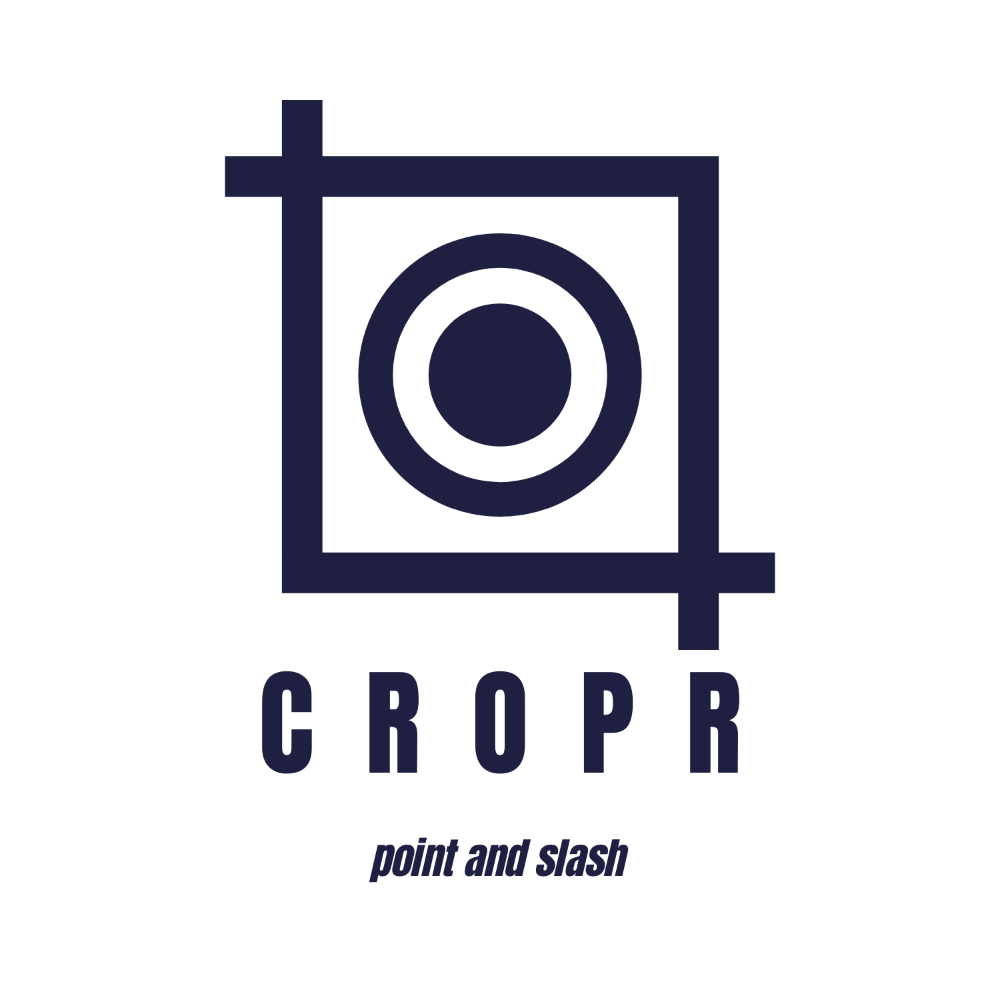
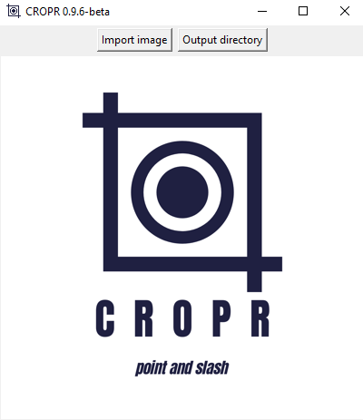
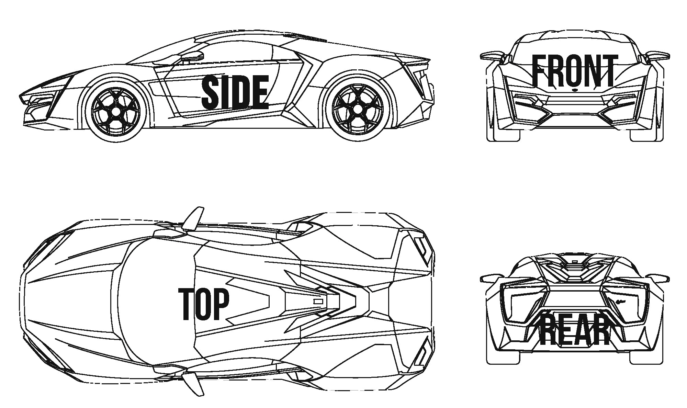
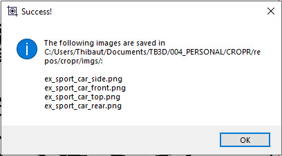

CROPR
=====

Welcome! If you're reading this it means you purchased or are considering purchasing CROPR.
This documentation will guide you on how to handle the application.

CROPR is a small stand-alone application that speeds up the preprocessing of vehicle blueprints
before using them as reference images: each view is cropped from the original blueprint and scaled accordingly
so it fit the other views dimensions.

Features
--------

Under the hood of CROPR is a very basic edge detector function: since 99% of the blueprints are
in black and white, the application uses a threshold value to detect the contour of each view.

Some edge cases exists, which is why CROPR has the following features:
- Ignore ground
- Mask
- Threshold adjustment
- Zoom
- Manual mode (no contour detection)

Installation
------------

No installation needed, simply run the executable file you downloaded

Contribute
----------

- https://gum.co/ZEyTk

Support
-------

If you are having issues, please let us know: support@thibautbourbon.com

License
-------

The project is licensed under the GPL license.

GETTING STARTED
===============

In this section we will cover the user interface and the standard procedure. Edge cases are treated in the next section.

User interface
--------------

To start CROPR, simply double click on the executable file you downloaded. The following menu should pop-up:

Loading a file
--------------

To load an image, you can either hit the "Import Image" button on the top bar and navigate to your file.
Another solution paste an image from the
clipboard by hitting the <Control + V> command.

Output directory
----------------

You can chose where the output files will be saved by pressing the "Output directory" button on
the top bar and browsing to the destination folder of your choice. By default the destination
folder is the one the input image has been loaded from, so if you chose the Paste method you might want to
make sure you save the output to a directory you know.

Commands
--------

Most of the commands are context based are visible under the cursor:

- <Scroll button> - Scroll up/down
- <Shift> + <Scroll button> - Scroll left/right
- <Num +> / <Num -> - Zoom in/out (NOTE: the image default size is the maximum size, see next paragraph)
- <G> - Ground mode
- <M> - Mask mode
- <C> - Contrast mode
- <N> - Manual mode
- <Control Z> - Undo
- <Control V> - Paste image
- <Esc> - skip
- <Space bar> - confirm

Zoom
----

Sometime, the imported image is huge. Like, way too big to properly work on it. Before starting to define the bounding boxes and
crop the hell out of the blueprint, you can reduce the size of the image. Once you're happy with it, you can start clicking around.
Note that this implies less accurate results since this changes the image resolution. Note as well the maximum allowed resolution
is the initial one.

Isolating views
---------------

A typical blueprints shall look like the following:

(Obviously the views can placed differently)

Once the blueprint is imported and the output folder is chosen, you can see below the cursor which view to isolate. The order
is always the following:

- Side > Front > Top > Rear

If you're not sure, just take a look beneath the cursor, the current view being treated is displayed.

To isolate the view, simply define by two clicks a large bounding box around the view. After the second click, CROPR will automatically
resize the bounding box to fit the contour, and you can move on to the next view:

.. raw:: html

    <iframe width="1120" height="613" src="https://www.youtube.com/embed/S1c5W2jchZY" frameborder="0" allow="accelerometer; autoplay; encrypted-media; gyroscope; picture-in-picture" allowfullscreen></iframe>

Notice how the text under the pointer is updated.
Repeat this operation for each view and after the last view, you have one last click to confirm:

.. raw:: html

    <iframe width="1120" height="630" src="https://www.youtube.com/embed/NhQSxOga-1k" frameborder="0" allow="accelerometer; autoplay; encrypted-media; gyroscope; picture-in-picture" allowfullscreen></iframe>

Then, a pop-up message will confirm everything went well and where you can find the output files.

Skipping view
-------------

Some blueprint do not include all views, or sometime you may only be interested by only a fraction of the available views.
CROPR enables you to skip isolating a view by hitting the <Escape> button.

..image_escape_exemple_

Undo
----

Sometime, you want to undo the action you just did. Simply hit <Control + Z> to jump back to the previous view.

EDGE CASES
==========

In some cases, the blueprint you imported is not as clean as we wish it should be: annotations such as ground level or dimensions are present, 
or some views overlap each other. There are different way to deal with these deviations:

Ground mode
-----------

A feature often present in cars blueprint is the ground location. While this can be useful to align the different views, it actually
becomes a hinder for CROPR when finding the contours of the view.

..image_wrong_result..

To work around this issue, activate the ground mode by hitting the <G> key. Notice the background color changes as well.

..image_to_ground_mode..

The purpose of the ground mode is to tell CROPR where (approximately) is located the ground, so CROPR can ignore it. In ground mode,
you define the large bounding box as usual. After the second click appears a horizontal line, that you have to place slightly above 
the ground (not too high thoug or CROPR can miss details!). 
Usually 5-10 pixels above the floors are enough:

..image_ground_mode_

Mask mode
---------

In some other case, annotations or watermark are messing with the way CROPR calculates the contour. In this mode as well, the purpose
is to help CROPR do its work and let it know what to ignore. To activate the Mask mode, hit <M>. Here as well, the background color changes:

..image_to_mask_mode..

Once the large boundary box is defined, i.e after the second click, you jump to mask mode. The pointer turns into a grey box, which
you can change size by pressing <1>, <2> or <3> on the Num pad.

..image_zoom_boxes..

Click on any incriminated area, the red bounding box will update in real time. Once you're happy with it, hit the
<Spacebar> to confirm and carry on to the next view.

..image_update_box..

Contrast mode
-------------

In cases where the blueprints includes a lot of gray gradient, CROPR can have trouble finding the
correct contour. You can help CROPR by turning on the Contrast mode with the <C> key, which will allow you to
adjusting the threshold value once the large bounding box is defined. Notice the change of background color.

..image_turn_threshold_on

Once in the contrast mode, use the <+> and <-> buttons of the num pad to play with the threshold, and hit <Spacebar> when
you are satisfied with the result.

..image_good_example

Manual mode
-----------

Sometime, it's too much to handle for CROPR and you need to have full control. The manual will tell CROPR to let you
have the command and decide how the bounding box is supposed to look.

..image_manual_mode

FUTURE RELEASES
===============

CROPR is still very young and comes with its flaws. If you notice unexpected behaviour, report it by all mean!

Some known limitations, to be fixed in future releases are:

- Starting time can be up to 10s depending on your computer
- The edge cases mode are not cumulative, that means you cannot combine mask mode and ground mode at the moment
- Zoom function is limited to reduce size

